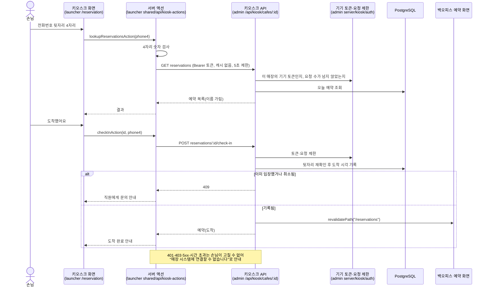
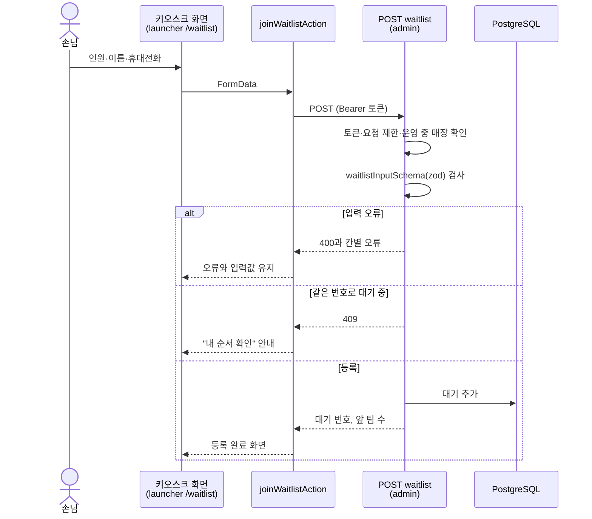
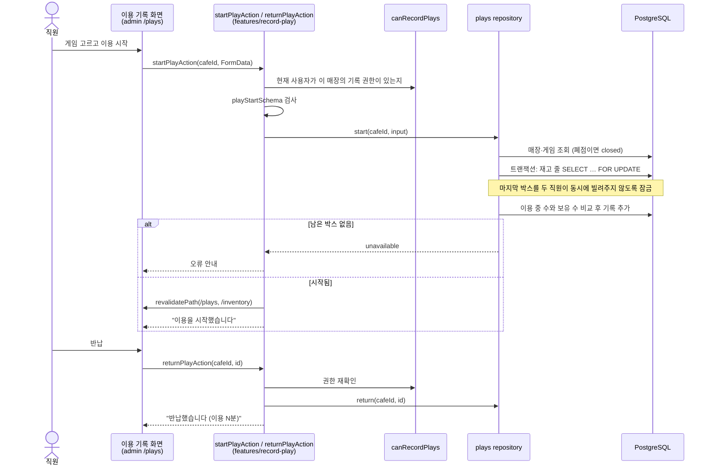

# 시퀀스 다이어그램

키오스크(`apps/launcher`)와 백오피스(`apps/admin`) 사이의 주요 흐름입니다.

## 1. 키오스크 예약 확인과 도착 알림

키오스크는 백오피스 주소와 기기 토큰을 서버에만 두고, 서버 액션이 백오피스의 키오스크 API를 대신 부릅니다.

```mermaid
sequenceDiagram
    actor 손님
    participant 키오스크 as 키오스크 화면<br/>(launcher /reservation)
    participant 액션 as 서버 액션<br/>(launcher shared/api/kiosk-actions)
    participant API as 키오스크 API<br/>(admin /api/kiosk/cafes/:id)
    participant 인증 as 기기 토큰·요청 제한<br/>(admin server/kiosk/auth)
    participant DB as PostgreSQL
    participant 직원 as 백오피스 예약 화면

    손님->>키오스크: 전화번호 뒷자리 4자리
    키오스크->>액션: lookupReservationsAction(phone4)
    액션->>액션: 4자리 숫자 검사
    액션->>API: GET reservations (Bearer 토큰, 캐시 없음, 5초 제한)
    API->>인증: 이 매장의 기기 토큰인지, 요청 수가 넘지 않았는지
    API->>DB: 오늘 예약 조회
    API-->>액션: 예약 목록(이름 가림)
    액션-->>키오스크: 결과
    손님->>키오스크: 도착했어요
    키오스크->>액션: checkInAction(id, phone4)
    액션->>API: POST reservations/:id/check-in
    API->>인증: 토큰·요청 제한
    API->>DB: 뒷자리 재확인 후 도착 시각 기록
    alt 이미 입장했거나 취소됨
        API-->>액션: 409
        액션-->>키오스크: 직원에게 문의 안내
    else 기록됨
        API->>직원: revalidatePath("/reservations")
        API-->>액션: 예약(도착)
        액션-->>키오스크: 도착 완료 안내
    end
    Note over 액션,API: 401·403·5xx·시간 초과는 손님이 고칠 수 없어<br/>"매장 시스템에 연결할 수 없습니다"로 안내
```

## 2. 현장 대기 등록

```mermaid
sequenceDiagram
    actor 손님
    participant 키오스크 as 키오스크 화면<br/>(launcher /waitlist)
    participant 액션 as joinWaitlistAction
    participant API as POST waitlist<br/>(admin)
    participant DB as PostgreSQL

    손님->>키오스크: 인원·이름·휴대전화
    키오스크->>액션: FormData
    액션->>API: POST (Bearer 토큰)
    API->>API: 토큰·요청 제한·운영 중 매장 확인
    API->>API: waitlistInputSchema(zod) 검사
    alt 입력 오류
        API-->>액션: 400과 칸별 오류
        액션-->>키오스크: 오류와 입력값 유지
    else 같은 번호로 대기 중
        API-->>액션: 409
        액션-->>키오스크: "내 순서 확인" 안내
    else 등록
        API->>DB: 대기 추가
        API-->>액션: 대기 번호, 앞 팀 수
        액션-->>키오스크: 등록 완료 화면
    end
```

## 3. 백오피스 대여와 반납

```mermaid
sequenceDiagram
    actor 직원
    participant 화면 as 이용 기록 화면<br/>(admin /plays)
    participant 액션 as startPlayAction / returnPlayAction<br/>(features/record-play)
    participant 권한 as canRecordPlays
    participant 저장소 as plays repository
    participant DB as PostgreSQL

    직원->>화면: 게임 고르고 이용 시작
    화면->>액션: startPlayAction(cafeId, FormData)
    액션->>권한: 현재 사용자가 이 매장의 기록 권한이 있는지
    액션->>액션: playStartSchema 검사
    액션->>저장소: start(cafeId, input)
    저장소->>DB: 매장·게임 조회 (폐점이면 closed)
    저장소->>DB: 트랜잭션: 재고 줄 SELECT … FOR UPDATE
    Note over 저장소,DB: 마지막 박스를 두 직원이 동시에 빌려주지 않도록 잠금
    저장소->>DB: 이용 중 수와 보유 수 비교 후 기록 추가
    alt 남은 박스 없음
        저장소-->>액션: unavailable
        액션-->>화면: 오류 안내
    else 시작됨
        액션->>화면: revalidatePath(/plays, /inventory)
        액션-->>화면: "이용을 시작했습니다"
    end
    직원->>화면: 반납
    화면->>액션: returnPlayAction(cafeId, id)
    액션->>권한: 권한 재확인
    액션->>저장소: return(cafeId, id)
    액션-->>화면: "반납했습니다 (이용 N분)"
```
